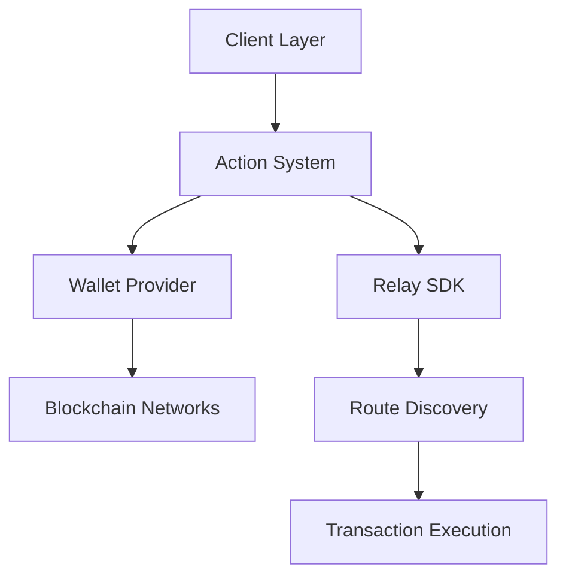
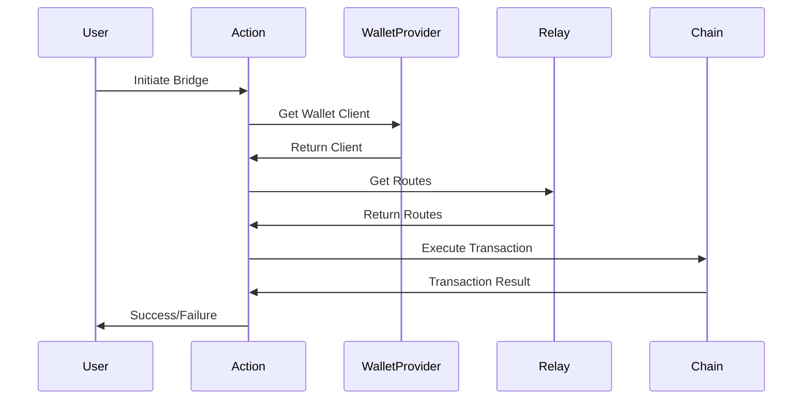

# System Patterns: EspressoX

## Architecture Overview



## Core Components

### 1. Action System
- **Pattern**: Command Pattern
- **Location**: `src/actions/`
- **Key Files**:
  - `bridge.ts`: Cross-chain transfers
  - `swap.ts`: Token swaps
  - `transfer.ts`: Standard transfers

#### Action Structure
```typescript
{
    name: string;
    description: string;
    handler: async (runtime, message, state, options, callback) => boolean;
    template: Template;
    validate: async (runtime) => boolean;
    examples: Example[];
    similes: string[];
}
```

### 2. Wallet Provider
- **Pattern**: Provider Pattern
- **Location**: `src/providers/wallet.ts`
- **Responsibilities**:
  - Chain configuration management
  - Wallet client initialization
  - Address management

### 3. Service Layer
- **Pattern**: Service Layer Pattern
- **Location**: `src/services/`
- **Purpose**: Business logic isolation

### 4. Template System
- **Pattern**: Template Method Pattern
- **Location**: `src/templates/`
- **Usage**: Standardized interaction patterns

## Key Design Patterns

### 1. Dependency Injection
```typescript
constructor(private walletProvider: WalletProvider) {
    this.config = createConfig({...});
}
```

### 2. Factory Pattern
- Used in wallet client creation
- Chain configuration initialization
- Service instantiation

### 3. Observer Pattern
- Transaction monitoring
- State updates
- Event handling

### 4. Strategy Pattern
- Route selection
- Chain interaction
- Token handling

## Data Flow



## Error Handling

### Pattern: Error Propagation
```typescript
try {
    const bridgeResp = await action.bridge(bridgeOptions);
    // Success handling
} catch (error) {
    // Error handling with context
}
```

## State Management

### 1. Runtime State
- Managed by ElizaOS framework
- Persists across operations
- Handles user context

### 2. Transaction State
- Managed per operation
- Includes validation state
- Tracks execution progress

## Critical Paths

### 1. Bridge Operation
1. Parameter validation
2. Wallet verification
3. Route discovery
4. Transaction execution
5. Status confirmation

### 2. Token Management
1. Address resolution
2. Balance verification
3. Allowance checking
4. Transaction preparation

## Integration Patterns

### 1. Relay SDK Integration
- Route discovery
- Transaction execution
- Status monitoring

### 2. Chain Integration
- Multiple chain support
- Consistent interfaces
- Error standardization

## Security Patterns

### 1. Input Validation
- Parameter checking
- Address validation
- Amount verification

### 2. Transaction Safety
- Gas estimation
- Slippage protection
- Transaction confirmation
